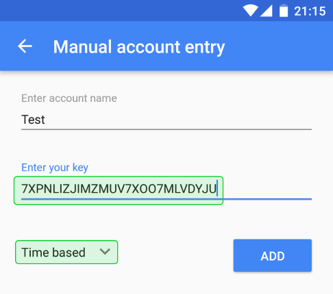

# Overview

This is an implementation of the Time-based One-time password algorithm, also known as TOTP and used in commonly named Two Factor Authentication.

You can find more information about this algorithm on [Wikipedia][3] and by reading the [RFC 6238][4].

By default, the tool prints the time-based one-time passwords continually until you stops it. This behaviour can be tweaked with options.

This tool requires .NET Core 2.1 or higher to run.

# Install / Download

## With .NET Core tool

Run the following command:

```
dotnet tool install -g TanukiSharp.OneTimePassword
```

Done.

Read the [following article][10] for more information about .NET Core tools.

## Manually

If you encounter troubles with .NET Core tool command or prefer to download manually, you can **[download the latest here](https://raw.githubusercontent.com/TanukiSharp/OneTimePassword/master/Builds/TanukiSharp.OneTimePassword_0.0.1.zip)**.

If you need or want a previous version, you can find them all **[here](
https://github.com/TanukiSharp/OneTimePassword/tree/master/Builds)**.

## Using NuGet

The package is available on NuGet for you to retrieve directly if needed, **[here](https://www.nuget.org/packages/TanukiSharp.OneTimePassword/0.0.1)**.

# How to use

The first step to understand how the tool works is to run it without any argument. That will print the following usage:

```
TanukiSharp.OneTimePassword v0.0.1.0

  --secretFile <file>            Absolute or relative file containing the secret text
  --secret <secret>              Secret text (--secretFile takes precedence if given)

  Arguments --secretFile and --secret are mutually exclusive, but one of them must be given

  --hmac <hamc>                  HMAC algorithm to use, available values are SHA1, SHA256 and SHA512 (defaults to SHA1)
  --time <offset> | <datetime>   Positive or negative offset in seconds from UTC now, or fixed UTC date and time
  --trucate <number>             Truncates the OTP to <number> digits (defaults to 6)
  --once                         Prints OTP only once and without line feed (defaults to unset)
  --no-inner-spaces              OTP is printed without any spaces (defaults to unset)
  --prev                         Also prints previous OTP (defaults to unset)
  --next                         Also ptints next OTP (defaults to unset)

  -h | -? | --help               Prints this help usage
```

## Mandatory secret argument

The only mandatory part is the secret, because this is the only thing that cannot be defaulted.

There are two way to provide the secret, either directly on the command line, with the argument `--secret` or by providing a file that contains the secret, with the argument `--secretFile`.

The `--secretFile` can be provided an absolute path, or a relative path. In the latter case, the file is considered relative to the current working directory, and not the directory where the tool is located.

## Other optional arguments

### HMAC

The [RFC 6238][4] allows to use different [HMAC][5] algorithms, such as [SHA1][6], [SHA256][7] and [SHA512][7].

The value to provide to the `--hmac` argument is case insensitive.

The default value is [SHA1][6].

### Time

Since its name implies the time-based one-time password algorithm is based on time to define the public part of the private/public pair.

You can tweak the time provided to the algorithm using the `--time` argument.

The value can be a number, in which case this will become an offset of the current UTC time, in seconds. For example: `--time 15` (`--time +15` also works) or `--time -37`.

It can also be a fully specified date and time, such as `--time 2018/06/22T20:57:34Z`. The date and time formats supported are all the formats natively supported by [.NET][8].

Since this could be a complex topic, you better refer to the **[documentation][9]** for more details.

**Note:** when using a fully specified date, you do not get update every 30 seconds anymore, because you froze time given to the algorithm to that very specified date.

The default value is the UTC time based on your current locale system clock. This is also the same as providing offset of 0, such as `--time 0`.

**Note:** the time-based one-time password algorithm uses a time step of 30 seconds. Technically it could be parameterizable, but it is not at the moment, and simply follows the recommendations of the [RFC][4].

### Truncate

The truncate value is a number that can be comprised between 1 and 8. Bellow 1 it is clamped to 1 and above 8 the value is clamped to 8.

The default value is 6.

### Once

This is a flag that can be set with `--once` and tells the tool to print the current time-based one-time password only once, and then the tool stops.

It prints the password without additional line feed.

This can be useful if you need to pipe the output of the tool into the input of another one. If you still need a line feed, the simplest is probably to `echo` it, such as:

```bash
echo `OneTimePassword ... --once` | ...
```

This flag is unset by default.

### Inner spaces

Time-based one-time passwords are printed with inner spaces by default to make them easier to read.

So providing the flag `--no-inner-spaces` disables the feature and makes password printed without any spaces.

You may want this flag set when using the above-mentioned `--once` flag.

This is not in the printed in the usage for clarity reason, but you can also provide the flag in the singular form, without the trailing 's' such as `--no-inner-space`.

As mentioned above, this flag is unset by default, meaning inner spaces are printed by default.

### Previous password

The flag `--prev` can be used to print the previous time-based one-time password, alongside the current one.

It is not possible to print only the previous one with this method. If you need to do so, it can be achieved with the `--time` option, providing the `-30` value for example.

This is not in the printed in the usage for clarity reason, but you can also set the flag with the `--previous` argument.

This flag is unset by default.

### Next password

The flag `--next` can be used to print the next time-based one-time password, alongside the current one.

It is not possible to print only the next one with this method. If you need to do so, it can be achieved with the `--time` option, providing the `+30` value for example.

This flag is unset by default.

# Test the implementation

To test this implementation, you can download the Google Authenticator application for [Android][1] or for [iOS][2], and compare the result you get on your screen.

Add a new code, and type the secret manually, as on the following screenshot:

*Make sure to select 'Time based' and not 'Counter based'.*



Then if you run the tool with option `--secret 7XPNLIZJIMZMUV7XOO7MLVDYJU`, you should see codes matching on your phone and on the console application.

# Base32 implementation

The `Base32` implementation is a naive implementation and allocates a lot of memory.
A better implementation could allocate much less, but would require a bit more work, and several unit tests.

[1]: https://play.google.com/store/apps/details?id=com.google.android.apps.authenticator2
[2]: https://itunes.apple.com/us/app/google-authenticator/id388497605
[3]: https://en.wikipedia.org/wiki/One-time_password
[4]: https://tools.ietf.org/html/rfc6238
[5]: https://en.wikipedia.org/wiki/HMAC
[6]: https://en.wikipedia.org/wiki/SHA-1
[7]: https://en.wikipedia.org/wiki/SHA-2
[8]: https://www.microsoft.com/net/
[9]: https://docs.microsoft.com/en-us/dotnet/api/system.datetime.tryparse?view=netframework-4.7.2#System_DateTime_TryParse_System_String_System_DateTime__
[10]: https://docs.microsoft.com/en-us/dotnet/core/tools/global-tools
